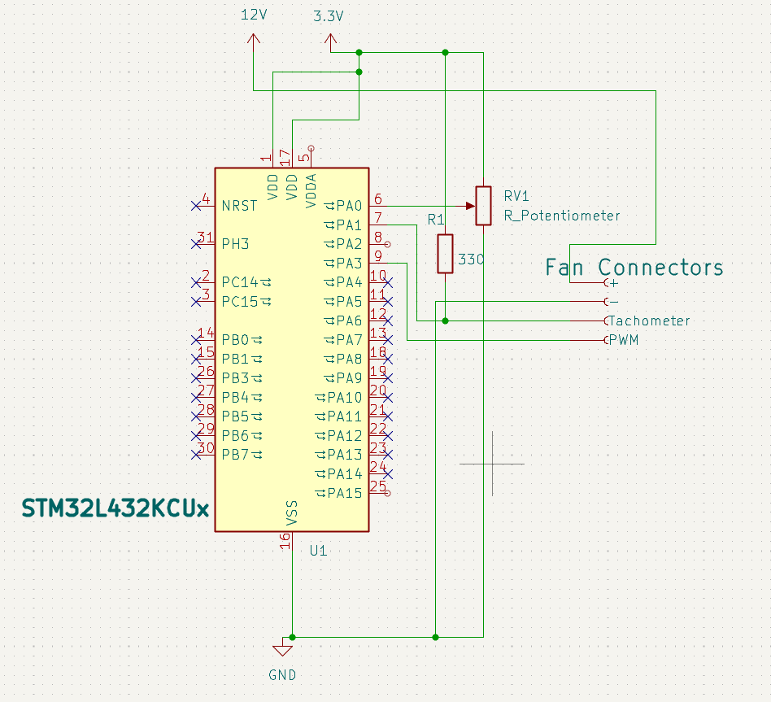

# STM32 Fan Speed Controller
# Table of Contents
[Introduction](https://github.com/Ashrafharuna7/Embedded-Systems#introduction)

[List of Components used](https://github.com/Ashrafharuna7/Embedded-Systems/blob/main/README.md#list-of-components-used)

[Features](https://github.com/Ashrafharuna7/Embedded-Systems/blob/main/README.md#features)

[Circuit Diagram](https://github.com/Ashrafharuna7/Embedded-Systems/blob/main/README.md#circuit-diagram)

## Introduction
The aim of this project is to control the speed of a PC fan using **PWM** on an STM32L432KC microcontroller. 
The fan speed is measured using an in built tachometer.

## List of Components used
- STM32L432KC Microcontroller
- 12V DC PC Fan
- Potentiometer
- 330Ω Pullup resistor
- 12V Power supply

## Features
- PA3 is used to control the fan speed using its alternative function **PWM** mode.
- PA1 is used to measure the speed of the fan using an in built tachometer with its timer alternative function mode.
- PA0 is used to read the input voltage from the potentiometer and convert it to a digital value. (Analog to digital).
- PA15 and PA2 is used to send the RPM readings of the fan to a serial monitor using **UART**.
- Below is Table 15 showing the alternative functions of the used pins.

## Circuit Diagram
The fan is powered using a 12V DC power supply and has its tachometer and PWM connected to PA1 and PA3 respectively. The microcontroller is connected via USB to the laptop. The poteniometer is connected to the 3.3V of the microcontroller and PA0. This allows the microcontroller to read the input voltage from the potentiometer as a digital value. There is a pullup resistor connected to the tachometer and 3.3V to pull the signal **HIGH** when the fan is not pulling it **LOW**. The microcontroller uses UART serial communication to communicate to the laptop. This is done on both PA2 and PA15. The circuit digram can be seen below: 

## Calculating the RPM
To measure the fan speed, the tachometer signal from the fan was used. When a fan blade completes one full rotation, the tachometer signal transitions from **HIGH to LOW** and **LOW to HIGH**. The fan is an example of a rotary encoder and the time between the pulses tells us the speed. When the fan completes a full rotation it outputs a pulse. The time difference between to consecutive rising or falling edges is used to calculate the rpm. The RPM calculation is as follows: 
- Period = (1000*duration/Clockspeed),period in milliseconds
- rpm = 60000/period

## Troubleshooting Common issues and during the project
### No RPM Reading
**Ensure that the tachometer has a pull-up resistor (around 4.7kΩ or more) connecting to 3.3V.**\
  While tryng to measure the rpm output, it seemed like some of the readings from the tachometer signal was random. This could be due to not having a sufficient pull-up resistor. The pullup     resistor used was only a value of 330Ω which is normally too low. Adding a higher resistor may have stabalised the readings
  
**Ensure that PA1 is correctly configured as an input capture pin.**\
  I had issues when trying to read the tachometer signal as PA1 was not configured as an alternative function for timer2. It is important to make sure that PA1 is configured as an alternative   function for timer2 input capture on the correct channel (Channel 2)

### PWM not controlling the fan
**Verify the potentiometer connections**\
A big issue that I faced during this project was the wiring of the potentiometer. I connected the potentiometer to the 12V power supply which damaged my board and required a replacement. It is important to draw a schematic before starting to connect anything to prevent such mistakes.

**Check PWM signal using an oscilloscope**\
It was a good idea to check the PWM signal using an oscilloscope to verify if changing the duty cycle changed the speed of the fan.

    
